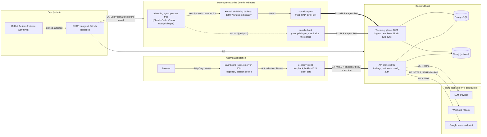

# Threat model

What Correlic protects, who it protects against, what it sees, what it does
not see, and where the mitigations live in the code. Read it before changing
anything on the ingest path, the agent, the hook or the release pipeline, and
read it as a self-hoster to decide whether the residual risks are acceptable.

Companion documents: [`../../SECURITY.md`](../../SECURITY.md) (reporting,
hardening checklist, verifying a release), [`AUTH_AND_RBAC.md`](AUTH_AND_RBAC.md),
[`ARCHITECTURE.md`](ARCHITECTURE.md), [`HOOKS.md`](HOOKS.md),
[`LINUX_AGENT.md`](LINUX_AGENT.md), [`MACOS_AGENT.md`](MACOS_AGENT.md),
[`WINDOWS_AGENT.md`](WINDOWS_AGENT.md), [`BLOCK_RULES.md`](BLOCK_RULES.md),
[`RELEASE_PROCESS.md`](RELEASE_PROCESS.md).

## 1. What Correlic is, in one paragraph

A host agent (root, eBPF on Linux; ETW and the Security log on Windows;
Endpoint Security via `eslogger` or polling on macOS) records what processes
in an AI coding agent's process tree execute, open, connect to and resolve,
and ships those events over mTLS to a backend. `correlic-hook` adds the tool
calls that Claude Code and Cursor make, from inside the editor. The backend
samples, runs detection rules and chain patterns on AI-attributed events,
clusters findings into incidents, notifies, and lets an analyst investigate
in a dashboard, optionally with their own LLM key. Block rules let the agent
kill a matching process and let the hook deny a matching tool call. It is a
monitor with limited enforcement, not an EDR for humans and not a sandbox.

## 2. Assets

| Asset | Where it lives | Why it matters |
|---|---|---|
| Telemetry: command lines, file paths, destinations, DNS names, tool calls, AI session attribution | PostgreSQL (`telemetry_events`, `events`), optional Neo4j graph; in flight on the agent and on the wire | Command lines and paths routinely contain secrets and reveal what a team works on. Integrity matters as much as confidentiality: forged or dropped events blind the detection. |
| Findings, incidents, baselines, block rules, exceptions, detection settings | PostgreSQL | Tampering changes what is alerted on and what gets killed. A malicious block rule is a denial-of-service primitive on every monitored host. |
| Credentials: dashboard API keys, agent keys, client certificates, user passwords and sessions, the bootstrap credentials file | PostgreSQL (hashed), `agent.yaml` and `/etc/correlic/*.env` (0600), the data volume, the first-start log | An agent key lets you inject events; a dashboard admin lets you reconfigure enforcement and read everything. |
| `LLM_ENCRYPTION_KEY` and the encrypted provider keys | `/etc/correlic/correlic.env`; `llm_settings` rows | Your OpenAI/Anthropic/Gemini/Groq key, and with it your bill and the incident context sent to that provider. |
| Notification endpoints (webhook URLs, Slack webhooks) | PostgreSQL | Secrets in their own right, and a pivot into your internal network if SSRF protection fails. |
| The agent's privileges (root, `CAP_BPF`, `CAP_SYS_ADMIN`, kill) | Monitored host | The agent can terminate processes; its config file points it at a backend. |
| The release artifacts (images, bundles, packages) and the build pipeline | GHCR, GitHub Releases, `.github/workflows/` | Correlic runs as root on developer machines. A tampered release is a supply-chain attack on every user. |
| The eBPF programs and their generated objects | `agent/internal/ebpf/bpf/`, generated at build time | Code that runs in the kernel of every monitored host. |

## 3. Trust boundaries

| Boundary | Between | Crossing controls |
|---|---|---|
| B1 | Kernel and the agent | Kernel-verified eBPF programs; ring buffers; the agent runs as root. Nothing below root is trusted to tell the truth, and root is trusted completely. |
| B2 | Monitored host and the telemetry plane | TLS 1.2+, server certificate pinned to `tls_ca_file`, client certificate required on agent routes, agent-type key limited to ingest/heartbeat/agent routes, per-caller rate limit. |
| B3 | Dashboard and the API plane | mTLS held by `ui-proxy` on loopback, `Authorization` required on every proxied request, dashboard key or session with a role, admin role for configuration writes. |
| B4 | Analyst's browser and the dashboard | `HttpOnly`/`SameSite=Lax`/`Secure` session cookie, login throttling, route protection in `ui/proxy.ts`. |
| B5 | Backend and the internet | Only configured destinations; outbound URL validation against internal ranges; redirects disabled; LLM calls only with an admin-configured, encrypted key. |
| B6 | Project and self-hoster | Sigstore keyless signatures, SBOM attestations, SLSA provenance, checksum files; verification commands in `SECURITY.md`. |

## 4. Attacker models

### A1. A prompt-injected or malicious AI coding agent on a developer machine

**Capabilities.** Runs as the developer, inside the editor's process tree.
Can run any command the developer can, read any file the developer can
(`~/.ssh`, `~/.aws`, `.env`, browser profiles), reach the network, edit the
developer's dotfiles and the editor's settings, and spawn subprocesses that
try to look like ordinary tooling. Does not have root unless the developer
has passwordless `sudo`.

**Goals.** Exfiltrate credentials or source, persist (cron, systemd user
units, shell profiles), move laterally with found keys, or quietly weaken the
project it is editing.

**What Correlic does.** This is the primary use case. Every exec, file open,
connection and DNS lookup in the AI session's process tree is recorded with
the session id (`agent/internal/lineage/`, kernel-side `ai_pids` map with
lazy inheritance, `backend/docs/ai_process_tracking.md`); the sampler keeps
every suspicious path and every always-keep event type before dropping
anything (`backend/internal/ingest/sampler.go`); 13 rules and 11 chain
patterns fire on credential reads, exfiltration shapes, persistence,
privilege escalation and container escape (`DETECTION_ENGINE.md`); block
rules can kill a matching process (`agent/internal/enforcer/`) and deny a
matching tool call before it runs (`agent/cmd/correlic-hook`); hook events
are always kept and `ai.tool_call_sensitive_path` fires on sensitive paths in
commands.

**What it does not do.** See section 5: the hook can be removed or bypassed
by the same user; the kernel agent sees the action but not the data; a
soft-block kills after the action started; no rule exists for techniques
nobody wrote a rule for.

### A2. A compromised developer machine trying to blind the monitor

**Capabilities.** An attacker (or the AI agent after a successful privilege
escalation) with root on the monitored host.

**Goals.** Stop the agent, feed it nothing, feed the backend lies, or
exhaust it so real events are dropped.

**What Correlic does.** The backend computes liveness from heartbeats
(`backend/internal/service/liveness.go`: stale, then offline) and shows it on
the Agents page; the agent counts and reports what it drops
(`agent/internal/dispatch/drops.go`, `drop_reason.go`); events are
rate-limited and deduplicated per host so one host cannot starve the backend
(`agent/internal/dispatch/rate_limiter.go`, backend rate limiter); the agent
key is limited to ingest routes, so a stolen `agent.yaml` cannot read other
hosts' data or change configuration; `agent.yaml` is written with mode 0600;
the agent excludes its own PID from kill rules.

**What it does not do.** A root attacker wins on that host: they can
`systemctl stop correlic-agent`, unload the eBPF programs, edit `agent.yaml`,
or replace the binary. Correlic does not hide, does not self-heal and does
not attest the agent's integrity. There is no alert yet when a host turns
stale or offline (planned). Forged events from a stolen agent key are
accepted as that host's events; nothing in the event payload is signed.

### A3. A malicious or compromised backend user

**Capabilities.** A member or admin account, a stolen session cookie, a
leaked dashboard API key, or someone who can reach port 8080 with a client
certificate.

**Goals.** Read every host's telemetry, create a block rule that kills
`ssh` or `bash` on all hosts, point notifications at an internal service,
enter their own LLM key to exfiltrate incident context, or create more keys.

**What Correlic does.** Two key types and two roles: agent keys never reach
dashboard routes; members cannot write configuration; every configuration
route requires `admin` (`backend/internal/api/middleware/role_guard.go`,
`auth.go`); every query is scoped by organisation; sessions expire and are
pruned; keys are revocable; login is throttled; every key or user change is
in `audit_events`; webhook URLs cannot point at loopback, private or
link-local addresses (`backend/internal/notification/urlcheck.go`); the
proxy forwards only an allowlist of paths and headers; provider keys are
encrypted at rest and never returned by the API.

**What it does not do.** An admin is trusted: there is no four-eyes rule on
block rules, no approval flow for notification endpoints, no per-host
scoping of what an admin can see. A stolen admin session is as good as the
admin until it expires or is logged out. The HTTP-level audit middleware
records status codes but its log line is currently disabled; the structured
`audit_events` table is the audit trail.

### A4. Supply-chain tampering of Correlic itself

**Capabilities.** A compromised dependency (Go module, npm package, GitHub
Action, base image), a compromised maintainer account, a tampered release
asset or image tag, or a poisoned build cache.

**Goals.** Ship a backdoored agent that runs as root on every monitored
host, or a backend that leaks telemetry.

**What Correlic does.** Everything is built from this repository by GitHub
Actions with pinned action versions and locked dependencies (`go.sum`,
`package-lock.json`); images are signed by digest with Sigstore keyless
signing and carry SLSA provenance (`mode=max`) and SBOM attestations; every
release asset and the checksum file is signed and verified in the same job
before upload (`.github/workflows/release-images.yml`,
`build-linux-bundle.yml`, `build-windows-bundle.yml`); SBOMs are published;
CodeQL, `govulncheck`, Trivy, dependency review and OpenSSF Scorecard run in
CI (`security.yml`, `scorecard.yml`); Dependabot updates all four
ecosystems; the installer verifies the bundle against `SHA256SUMS-linux.txt`
from the same release; `CODEOWNERS` requires the maintainer's review.

**What it does not do.** A compromised maintainer account with the ability to
merge and dispatch workflows can still produce a validly signed malicious
release: the signature proves *which workflow* built the artifact, not that
the source was benign. Builds are not reproducible. Actions are pinned to
release tags, not commit SHAs, until the Scorecard baseline is in. The
installer does not yet verify the Sigstore signature, only the checksum
(planned: see section 7).

## 5. What Correlic detects, and explicitly what it does not

### Linux (eBPF)

Sees: `execve` (with argv), `fork`, `exit`, `openat` (path and flags),
`connect`, `bind`, `accept`, `setuid`, `unlink`/`unlinkat`, DNS queries via
the kprobes in `agent/internal/ebpf/bpf/`. Attribution follows the process
tree from the AI root, including processes adopted in-kernel at fork time.

Does not see:

- **Data.** It records that `~/.aws/credentials` was opened, never what was
  read or where the bytes went. Memory-only payloads, pipes between
  processes and TLS plaintext are invisible.
- **Syscalls it has no probe for.** Reads and writes via `io_uring`, file
  access through `mmap` of an already-open descriptor, raw sockets, UDP sent
  with `sendto` on an unconnected socket, Unix domain sockets, `ptrace`
  injection into an existing process (the injected code runs under the
  victim's attribution).
- **What root hides.** Kernel rootkits, eBPF programs loaded by the attacker,
  processes in a mount or PID namespace the agent was not told about.
  Container activity is attributed via cgroups (`DetectContainerID`) but a
  container with its own kernel (a VM) is a different host.
- **Bursts.** Ring buffers have finite size; the dispatcher deliberately
  drops exec helper bursts and ephemeral processes
  (`DropExecHelperBurst`, `DropExecEphemeral`) and the backend sampler
  drops benign events. Drops are counted, not silent, but they are drops.
- **Hosts it cannot run on.** Kernels before 5.8 or without BTF.

### macOS (preview, built from source)

- **Polling path** (any macOS 11+): kqueue exec/exit events; file access by
  FSEvents polling every 2 s with *no process attribution* (attributed to
  "an AI session was active"); network by `lsof` polling every 2 s, so a
  connection shorter than the interval is missed; no DNS.
- **`eslogger` path** (macOS 13+, root plus Full Disk Access): real
  process exec/exit/fork and file-open events with PIDs from Apple's own
  Endpoint Security client. Network stays on `lsof` polling and there is
  still no DNS. Apple does not guarantee `eslogger`'s output format; the
  parser is tolerant and counts what it cannot parse, but a format change
  can silently reduce coverage until the agent is updated.
- **No native Endpoint Security client and no signed builds** without an
  Apple Developer Program membership the project does not hold; no block
  rule enforcement timing guarantees on macOS.
- Cursor or Claude Code running on the Mac host are not observed by an agent
  in a Linux VM; only the hook sees them.

### Windows (ETW + Security audit)

Process events need command-line auditing enabled in the audit policy;
file writes come from the USN journal (names, not contents); network from
ETW. Credential-looking arguments are redacted on the agent
(`agent/internal/windows/exec_runner.go`). No kernel driver, so an
Administrator can stop the agent or clear the log.

### AI tool hooks (`correlic-hook`)

- Sees only the tool calls the editor routes through its hook mechanism.
  A single allowed `bash` call that runs a script which runs ten more
  commands is one hook event; the ten commands are visible only to the
  kernel agent.
- Runs as the developer. The AI agent, as the same user, can edit
  `~/.claude/settings.json`, `~/.cursor/hooks.json` or
  `~/.correlic/hook.yaml`, set `block_enabled: false`, or delete the binary.
  A hook that stops reporting looks like a quiet session; the kernel agent
  is the backstop on Linux and Windows, and on macOS there is none.
- Fails open by design: a 2 s budget, rules cached for 60 s, and if the
  rules cannot be fetched and no cache exists the call is allowed
  (`HOOKS.md`). Post events are never denied.

### Enforcement (block rules)

- The agent's soft-block kills a process *after* `exec`, `open` or
  `connect` was observed: a short command may complete, a file may already
  be read, a connection may already have carried data. It is a tripwire
  with teeth, not a policy enforcement point.
- The hook's deny is pre-execution, with the bypasses above.
- Protected PIDs (the agent itself, AI root processes) are never killed, so
  a rule cannot be used to kill Correlic through Correlic.

### Backend

- Rules are AI-gated: only events attributed to an AI session are evaluated.
  A human doing the same thing in a terminal is recorded (if kept by the
  sampler) but not alerted on. Attribution is heuristic (executable and
  argument basenames, the startup `/proc` scan); it can miss a renamed
  binary or over-attribute a tool launched from an AI session's shell.
- Sampling keeps security-relevant events but still drops ~90 % of benign
  ones; reconstructing a full timeline of a benign session is not possible.
- The LLM features send incident context (command lines, paths, hostnames)
  to the provider you configure. That is a data flow you opt into.

## 6. Mitigations mapped to the code

| Threat | Mitigation | Code / configuration |
|---|---|---|
| Plain-text telemetry, MITM on B2 | HTTPS required, CA pinned, TLS 1.2+, client certificate required on agent routes | `agent/internal/config/config.go` (`allow_insecure_http`), `agent/internal/transport/http.go`, `backend/cmd/telemetry/main.go`, `backend/cmd/api/main.go`, `backend/internal/api/middleware/require_mtls.go`, `mtls_enroll.go` |
| Stolen agent credential used against dashboard routes | Agent key type restricted to ingest/heartbeat/agent routes | `backend/internal/api/middleware/auth.go` (`APIKeyTypeAgent`), `backend/internal/storage/postgres_api_key_store.go` |
| Member escalating to configuration writes | Admin role on every non-GET configuration route | `backend/internal/api/middleware/role_guard.go`, route wiring in `backend/cmd/api/main.go` |
| Credential theft from the database | Keys and session tokens stored as SHA-256 hashes; passwords bcrypt; provider keys AES-256-GCM | `postgres_api_key_store.go`, `postgres_user_store.go`, `backend/internal/ai/provider/settings_store.go` |
| Session theft via XSS or cross-site requests | `HttpOnly`, `SameSite=Lax`, `Secure` cookie; API routes 401 without it; `no-store` responses | `ui/lib/server/session.ts`, `ui/proxy.ts`, `backend/internal/api/middleware/security_headers.go` |
| Dashboard proxy abused as an open relay to the backend | Loopback bind, path allowlist, header allowlist, 401 without `Authorization`, CORS allowlist, 1 MB bodies | `ui-proxy/index.js` |
| Brute force and credential stuffing | Per-caller rate limit; unauthenticated-route limiter keyed by client address with per-account backoff | `backend/internal/api/middleware/ratelimit.go` |
| SSRF through notification endpoints | Destination validated against loopback/private/link-local/multicast on save, on test and before each delivery; redirects disabled; timeouts | `backend/internal/notification/urlcheck.go`, `webhook.go`, `slack.go` |
| Suspicious events sampled away | Always-keep and suspicious checks run before the benign drop | `backend/internal/ingest/sampler.go`, `sampling_rules.go` |
| Cross-organisation reads | Every store query filters by `org_id`; finding ids and cooldown keys are organisation-qualified | `backend/internal/storage/*`, `backend/internal/detection/` |
| Process-internals exposure | Debug endpoints off by default, admin-only when on | `backend/cmd/api/main.go` (`ENABLE_DEBUG_ENDPOINTS`) |
| Correlic killing itself or the AI root through a block rule | Protected PID set | `agent/internal/enforcer/enforcer.go` |
| One host flooding the backend | Agent-side rate limiting and dedupe with drop accounting; backend per-caller limiter | `agent/internal/dispatch/rate_limiter.go`, `dedupe.go`, `drops.go` |
| Hook blocking developers when the backend is down | Fail-open with a 2 s budget and a 60 s rule cache | `agent/cmd/correlic-hook`, `agent/internal/hook/` |
| Secrets in collected command lines | Redaction on Windows exec events; hook sends names and paths only | `agent/internal/windows/exec_runner.go`, `agent/internal/hook/config.go` |
| Secrets on disk on the host | `agent.yaml`, env files, keys and the bootstrap credentials written 0600 | `backend/cmd/admin` (bootstrap), `install/install.sh`, `install/linux/postinstall.sh`, `entrypoint.sh` |
| Tampered release | Keyless signatures by digest, SBOM attestations, SLSA provenance, signed checksum file, in-job verification | `.github/workflows/release-images.yml`, `build-linux-bundle.yml`, `build-windows-bundle.yml`; `SECURITY.md` "Verifying a release" |
| Vulnerable dependency shipped | govulncheck, Trivy, dependency review, CodeQL, Dependabot, Scorecard | `.github/workflows/security.yml`, `scorecard.yml`, `.github/dependabot.yml` |
| Unreviewed change to the pipeline or policy | Code owner review | `.github/CODEOWNERS` |

## 7. Residual risks and planned work

Accepted for now, in rough priority order:

1. **Root on a monitored host defeats the agent** and there is no alert when
   a host goes stale or offline. Planned: a liveness finding
   (`agent.offline`) with notification, and a periodic self-check that the
   eBPF programs are still attached.
2. **Event payloads are not authenticated beyond the transport.** A stolen
   agent key can forge any event for that host until revoked. Planned:
   per-agent client certificates by default in the installers (the backend
   already supports them), so revocation is per host and keys are never on
   disk in clear text.
3. **The hook is user-controlled** and fails open. This is inherent to a
   user-space hook; the kernel agent is the control that matters. Planned:
   a finding when a host that used to send hook events stops while the
   kernel agent still sees the editor running.
4. **Soft-block is post-hoc.** Pre-execution blocking on Linux needs an
   LSM-based eBPF program (`bpf_lsm`) and a policy for what to deny; it is
   on the roadmap behind a kernel-version gate.
5. **Actions are pinned to tags, not SHAs, and builds are not
   reproducible.** Planned: SHA pinning once Scorecard runs green, then a
   reproducibility check of the Go binaries (`-trimpath`, fixed
   `SOURCE_DATE_EPOCH`) between two independent builds.
6. **The installer verifies checksums, not signatures.** Planned:
   `install.sh` and `install.ps1` verify the `.sigstore.json` bundle with
   cosign when it is installed, and refuse to continue without it when
   `CORRELIC_REQUIRE_SIGNATURE=1`.
7. **Admins are fully trusted.** No approval step for block rules or
   endpoints, no per-host visibility scoping. Planned: an audit view in the
   dashboard first, approval flows if there is demand.
8. **The systemd units carry no sandboxing** (`ProtectSystem`,
   `ProtectHome`, `NoNewPrivileges` for the backend, UI and proxy units).
   Planned for the next packaging change; the agent unit needs
   `CAP_BPF`/`CAP_SYS_ADMIN` and stays privileged.
9. **macOS coverage is a preview** with the gaps listed above; it will stay
   that way until the project can sign builds.
10. **The LLM features send telemetry to a third party** of your choosing.
    Mitigated by encryption at rest of the key and admin-only configuration;
    not mitigated: the provider sees the context. Use a provider you trust
    with your command lines, or none.
